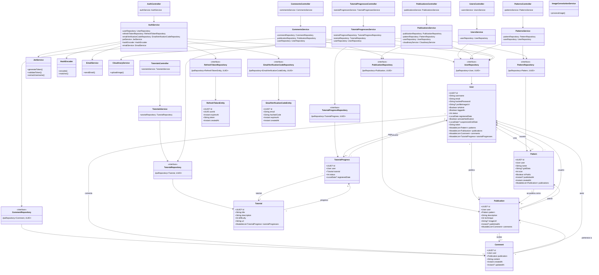

```mermaid
classDiagram
direction TB

%% =========================
%% CONTROLLERS
%% =========================

class AuthController {
  -authService: AuthService
}

class UsersController {
  -usersService: UsersService
}

class PatternsController {
  -patternsService: PatternsService
}

class PublicationsController {
  -publicationsService: PublicationsService
}

class CommentsController {
  -commentsService: CommentsService
}

class TutorialsController {
  -tutorialsService: TutorialsService
}

class TutorialProgressesController {
  -tutorialProgressesService: TutorialProgressesService
}

%% =========================
%% SERVICES
%% =========================

class AuthService {
  -userRepository: UserRepository
  -refreshTokenRepository: RefreshTokenRepository
  -emailVerificationCodeRepository: EmailVerificationCodeRepository
  -jwtService: JwtService
  -hashEncoder: HashEncoder
  -emailService: EmailService
}

class UsersService {
  -userRepository: UserRepository
}

class PatternsService {
  -patternRepository: PatternRepository
  -userRepository: UserRepository
}

class PublicationsService {
  -publicationRepository: PublicationRepository
  -patternRepository: PatternRepository
  -userRepository: UserRepository
  -cloudinaryService: CloudinaryService
}

class CommentsService {
  -commentRepository: CommentRepository
  -publicationRepository: PublicationRepository
  -userRepository: UserRepository
}

class TutorialsService {
  -tutorialRepository: TutorialRepository
}

class TutorialProgressesService {
  -tutorialProgressRepository: TutorialProgressRepository
  -tutorialRepository: TutorialRepository
  -userRepository: UserRepository
}

class JwtService {
  +generateToken()
  +validateToken()
  +extractUsername()
}

class HashEncoder {
  +encode()
  +matches()
}

class EmailService {
  +sendEmail()
}

class CloudinaryService {
  +uploadImage()
}

class ImageConvolutionService {
  +processImage()
}

%% =========================
%% REPOSITORIES
%% =========================

class UserRepository {
  <<interface>>
  JpaRepository~User, UUID~
}

class PatternRepository {
  <<interface>>
  JpaRepository~Pattern, UUID~
}

class PublicationRepository {
  <<interface>>
  JpaRepository~Publication, UUID~
}

class CommentRepository {
  <<interface>>
  JpaRepository~Comment, UUID~
}

class TutorialRepository {
  <<interface>>
  JpaRepository~Tutorial, UUID~
}

class TutorialProgressRepository {
  <<interface>>
  JpaRepository~TutorialProgress, UUID~
}

class RefreshTokenRepository {
  <<interface>>
  JpaRepository~RefreshTokenEntity, UUID~
}

class EmailVerificationCodeRepository {
  <<interface>>
  JpaRepository~EmailVerificationCodeEntity, UUID~
}

%% =========================
%% ENTITIES
%% =========================

class User {
  +UUID? id
  +String username
  +String email
  +String hashedPassword
  +String? profileImageUrl
  +Boolean isAdmin
  +Boolean loggedIn
  +Int status
  +LocalDate registeredDate
  +Boolean activateNotification
  +LocalDate? suspensionEndDate
  +String token
  +MutableList~Pattern~ patterns
  +MutableList~Publication~ publications
  +MutableList~Comment~ comments
  +MutableList~TutorialProgress~ tutorialProgresses
}

class Pattern {
  +UUID? id
  +User user
  +String name
  +String? gridData
  +Int size
  +Boolean isPublic
  +Instant? publishedAt
  +Instant createdAt
  +MutableList~Publication~ publications
}

class Publication {
  +UUID? id
  +User user
  +Pattern pattern
  +String description
  +Int technique
  +String? imageUrl
  +Instant? publishedAt
  +MutableList~Comment~ comments
}

class Comment {
  +UUID? id
  +User user
  +Publication publication
  +String content
  +Instant createdAt
  +Instant? updatedAt
}

class Tutorial {
  +UUID? id
  +String title
  +String description
  +Int difficulty
  +String url
  +MutableList~TutorialProgress~ tutorialProgresses
}

class TutorialProgress {
  +UUID? id
  +User user
  +Tutorial tutorial
  +Int status
  +LocalDate? registeredDate
}

class RefreshTokenEntity {
  +UUID? id
  +UUID userId
  +Instant expiresAt
  +String token
  +Instant createdAt
}

class EmailVerificationCodeEntity {
  +UUID? id
  +String email
  +String hashedCode
  +Instant expiresAt
  +Instant createdAt
}

%% =========================
%% CONTROLLER -> SERVICE
%% =========================

AuthController --> AuthService
UsersController --> UsersService
PatternsController --> PatternsService
PublicationsController --> PublicationsService
CommentsController --> CommentsService
TutorialsController --> TutorialsService
TutorialProgressesController --> TutorialProgressesService

%% =========================
%% SERVICE -> REPOSITORY
%% =========================

AuthService --> UserRepository
AuthService --> RefreshTokenRepository
AuthService --> EmailVerificationCodeRepository
AuthService --> JwtService
AuthService --> HashEncoder
AuthService --> EmailService

UsersService --> UserRepository

PatternsService --> PatternRepository
PatternsService --> UserRepository

PublicationsService --> PublicationRepository
PublicationsService --> PatternRepository
PublicationsService --> UserRepository
PublicationsService --> CloudinaryService

CommentsService --> CommentRepository
CommentsService --> PublicationRepository
CommentsService --> UserRepository

TutorialsService --> TutorialRepository

TutorialProgressesService --> TutorialProgressRepository
TutorialProgressesService --> TutorialRepository
TutorialProgressesService --> UserRepository

%% =========================
%% REPOSITORY -> ENTITY
%% =========================

UserRepository --> User
PatternRepository --> Pattern
PublicationRepository --> Publication
CommentRepository --> Comment
TutorialRepository --> Tutorial
TutorialProgressRepository --> TutorialProgress
RefreshTokenRepository --> RefreshTokenEntity
EmailVerificationCodeRepository --> EmailVerificationCodeEntity

%% =========================
%% ENTITY RELATIONSHIPS
%% =========================

User "1" --> "0..*" Pattern : crea
User "1" --> "0..*" Publication : publica
User "1" --> "0..*" Comment : comenta
User "1" --> "0..*" TutorialProgress : registra

Pattern "1" --> "0..*" Publication : se publica como
Publication "1" --> "0..*" Comment : recibe

Tutorial "1" --> "0..*" TutorialProgress : progreso

Comment "*" --> "1" User : autor
Comment "*" --> "1" Publication : pertenece a

Pattern "*" --> "1" User : usuario

Publication "*" --> "1" User : usuario
Publication "*" --> "1" Pattern : patrón

TutorialProgress "*" --> "1" User : usuario
TutorialProgress "*" --> "1" Tutorial : tutorial
```