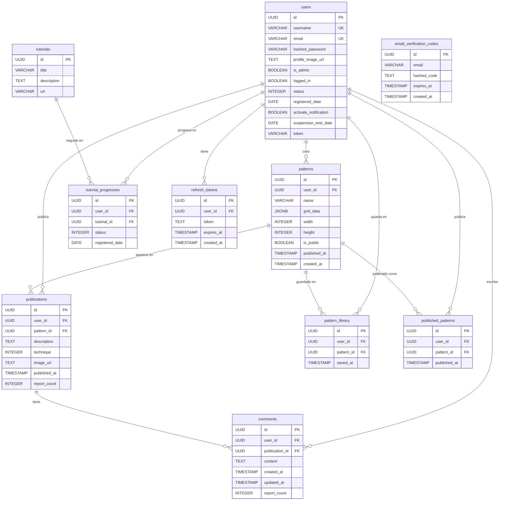

# Diagrama de Base de Datos — Patronika Backend

```mermaid
erDiagram
    users {
        UUID id PK
        VARCHAR username UK
        VARCHAR email UK
        VARCHAR hashed_password
        TEXT profile_image_url
        BOOLEAN is_admin
        BOOLEAN logged_in
        INTEGER status
        DATE registered_date
        BOOLEAN activate_notification
        DATE suspension_end_date
        VARCHAR token
    }

    patterns {
        UUID id PK
        UUID user_id FK
        VARCHAR name
        JSONB grid_data
        INTEGER width
        INTEGER height
        BOOLEAN is_public
        TIMESTAMP published_at
        TIMESTAMP created_at
    }

    publications {
        UUID id PK
        UUID user_id FK
        UUID pattern_id FK
        TEXT description
        INTEGER technique
        TEXT image_url
        TIMESTAMP published_at
        INTEGER report_count
    }

    tutorials {
        UUID id PK
        VARCHAR title
        TEXT description
        VARCHAR url
    }

    tutorial_progresses {
        UUID id PK
        UUID user_id FK
        UUID tutorial_id FK
        INTEGER status
        DATE registered_date
    }

    comments {
        UUID id PK
        UUID user_id FK
        UUID publication_id FK
        TEXT content
        TIMESTAMP created_at
        TIMESTAMP updated_at
        INTEGER report_count
    }

    refresh_tokens {
        UUID id PK
        UUID user_id FK
        TEXT token
        TIMESTAMP expires_at
        TIMESTAMP created_at
    }

    email_verification_codes {
        UUID id PK
        VARCHAR email
        TEXT hashed_code
        TIMESTAMP expires_at
        TIMESTAMP created_at
    }

    pattern_library {
        UUID id PK
        UUID user_id FK
        UUID pattern_id FK
        TIMESTAMP saved_at
    }

    published_patterns {
        UUID id PK
        UUID user_id FK
        UUID pattern_id FK
        TIMESTAMP published_at
    }

    users ||--o{ patterns : "crea"
    users ||--o{ publications : "publica"
    users ||--o{ tutorial_progresses : "progresa en"
    users ||--o{ comments : "escribe"
    users ||--o{ refresh_tokens : "tiene"
    users ||--o{ pattern_library : "guarda en"
    users ||--o{ published_patterns : "publica"
    patterns ||--o{ publications : "aparece en"
    patterns ||--o{ pattern_library : "guardado en"
    patterns ||--o{ published_patterns : "publicado como"
    publications ||--o{ comments : "tiene"
    tutorials ||--o{ tutorial_progresses : "seguido en"
```
